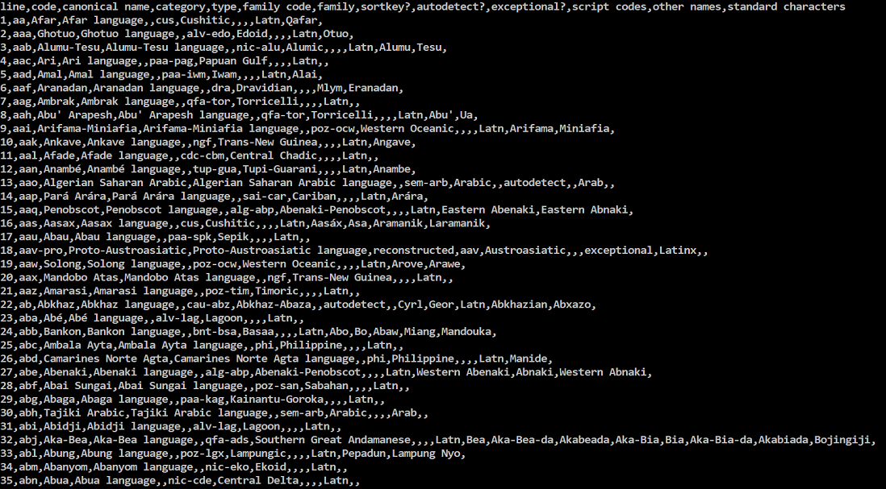

### KIK-LG219 Command line tools for linguists

In this course we learned the basics of working in a command line interface (CLI). In the first weeks we were introduced to the command line environment and learned how to navigate in a UNIX system as well as how to connect to a remote server. Later, we learned about corpus processing, which sure will come in handy for many language specialists. After this we were able to apply our skills in basic scripting. Finally, the contents of week six and seven taught us how to install and run programs and what version control like Git is, and why it is so powerful.  

Here I will briefly list and describe the themes and key commands introduced in each week's contents.

#### week 1: Setting up & essential commands

The first week was all about setting up the command line environment and learning how to make use of very basic commands like `cd`, `mkdir`, `ls`, `cat` and `less`. We got an introduction to mainly *emacs* but were encouraged to use any text editor we desired. For example, I worked with emacs for the most part of the course but eventually switched to *nano*. 

#### week 2: Digging deeper in the UNIX system, processes & remote servers

The first part of this week's tasks included getting a deeper insight into the previous contents of the first course week. Some key subjects were using different options for commands (`ls -F`), handling and modifying file permissions with `chmod` and finding ourselves in the system using `pwd`. We were also to learn how to compress and decompress files and directories with the commands `gzip` and `tar` in order to hand in our weekly homework.

The following part was an introduction to processes. We mainly learned theory related to the theme but also experienced how to run commands in the background for a random period of time and eventually kill a process. For instance, `sleep 5` puts bash asleep for five seconds. To run this process in the background, we write `sleep 5 &`.

Finally we covered a topic I personally found the most interesting and very useful: switching between local and remote servers. We learned to use the *ssh-program*, which uses secure shell to connect to a remote server. We even got to see an interview by Tatu Ylönen, the creator of ssh.  

#### week 3: Corpus processing for rookies

Text and corpus processing. Probably one of the topics that we students found most challenging. We started off by checking that our system supports utf-8 encoding, because working with a lot of corpora will eventually lead to the need of proper language settings. Fairly soon we also learned to use the commands `unix2dos` and `dos2unix`, which convert Unix text files to a Windows plain text format and vice versa:
```
unix2dos unixpoem.txt
```

For many questions in our weekly quizzes we had to find all instances of a word in a text. For this we worked with regular expressions and the grep command:
```
egrep "\b[Bb]ird\b" bird.txt` seeks all instances of **bird** or **Bird** in **bird.txt**. `\b` stands for word boundary. `egrep` is the same as `grep -E` and stands for extended regular expressions.
```
```
egrep "\bnest\b" bird.txt | wc -l` seeks all instances of **nest** in **bird.txt**. `wc -l` counts all the lines where **nest** appears.
```
Other useful commands that we learned are `head` (to read lines beginning from the first line of the file) and `tail` (to read lines from the last line of the file), `uniq` to search all repated lines and read them as one line only, `sort` to sort the lines ina file into either alphabetical or numerical order and finally `tr` to translate or transform some characters into others (for example, capital letters to lower case letters).

Besides having fun with ReGex we read about formatted text files, like .csv (comma-separated-values). A .csv-file can look like something like this:


#### week 4: Using *sed* and text processing pipelines  

This week was an introduction to the sed (stream editor) command. Sed is a powerful tool with multiple commands, like
*  substitution
* deletion
* insertion
* search.

The fact that sed always works a line at a time may be desired or not, depending on the purpose. In this course we mainly used sed to delete a string or substitute a string with a new value.

Sed uses various flags, from which the probably most used are
* `/g` for "Global". Makes changes for every instance of the RegEx, not only for the first occurrence in line (which is how sed works by default). 
* `/p` for "Print". When used together with the option `-n`, sed will only print modified lines, not all of them.

In the context of sed we learned how to use pipelines in order to give multiple commands in one take. Learning how to do this allowed us to create frequency lists, a sentence per line format and a list of word n-grams.

#### week 5: #!/scripting

Scripting! For the purposes of this week's quiz I created my first ever program. For example, we had to program a script, which generates English adjectives into their comparative forms (funny -> funnier, late -> later). I found this task utterly amusing and would like to learn scripting even better.

We learned how if statements work. The syntax would be something like

```
if [ <statement> ]
then
	<command(s)>
fi
```

We also learned the difference between environment and shell variables. Environment variables are variables that are inherited by any child process. Shell variables work within the shell only, in which they are defined. `printenv` prints all environment variables.

For all the aesthetic geeks in the club, we learned how to modify our prompt to look nice (or to just contain useful shortcuts for commands etc.). This can be made with configuration files (like .bashrc and .bash_profile), which make a setting, a script, permanent.
  
#### week 6: Managing programs & Makefiles

We learned how to become the root user and why you should prefer the sudo-option over working constantly as the root user. 

With instructions we managed to install software and python packages. For this topic it's almost vital to use a package manager like apt-get for Windows or brew for MacOS. 

Furthermore, we were introduced to Makefiles. Makefiles are one kind of scripts, which lets you run and compile programs conveniently. Say, you want to create a frequency list for various books but this process would take too much time to do. However, creating these frequency lists with a single Makefile is possible. The syntax for a make rule with target **%.freq** and dependency **%.no_md.txt** is:

```
%.freq: %.no_md.txt
    bin/freqlist.sh $< $@
``` 

#### week 7: Git and Version Control in general

Using Git is a way of backing up various stages when working on a project. Therefore, it's highly recommended to use it.

First, we created a GitHub account if we didn't already have one and set Git up in our system.

We moved on to creating a GitHub repository. You can either clone an existing, remote repository with `git clone` or use `git init` to initialize a new repository for your project. Then we learned the usual scheme of how to use Git:

| 1. git add | 2. git commit -m "<message>" | 3. git push |
|:----------:|:----------------------------:|:-----------:|
| add changes to repo staging area | capture all added changes | upload local repository content to a remote repository | 

#### week 8: Final Assignment

The final assignment for this course was to create a webpage using GitHub templates. This is mine, enjoy!

To make controlling the steps in our project easier we used Jekyll. With Jekyll we could effortlessly view our websites on a local server. So, during writing this course description I've used `bundle exec jekyll serve` probably hundreds of times. This command starts a local server.
